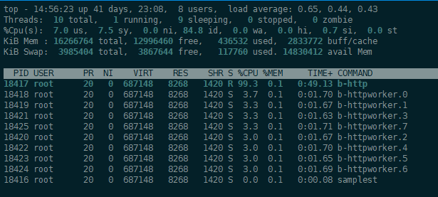
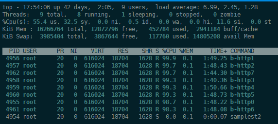

## HTTP ##
###V1版本###
从bitcoin里剥离http框架出来，基于libevent+queue为基础的框架，ab测试了下性能。

ab -n 1000000 -c 1000 -p post.txt -k  "http://192.168.50.171:8088/"

Requests per second:    24371.77 [#/sec] (mean)

可以发现主要的瓶颈在b-http线程，该主线程负责接收client请求，回调到http_request_cb，然后通过队列入队，唤醒worker线程处理。图中看到工作线程比较空闲。

###V2版本###
之前只有1个线程accept处理然后投递队列导致瓶颈，改造多线程accept即每个线程eventloop，无需队列，直接处理。利用linux的SO_REUSEADDR，SO_REUSEPORT(稍微修改下libevent源码create_bind_socket_nonblock加evutil_make_listen_socket_reuseable_port)可直接在端口上实现负载均衡。

之前用[Simple-Web-Server](https://github.com/eidheim/Simple-Web-Server)，压测性能不佳，不会随着CPU核数上升,TPS线性增长。

改造后ab压测(ab单线程跑，可能客户端会存在瓶颈，建议wrk压测)如下：

花了半天多时间改造代码(只支持echo)，代码还比较简陋